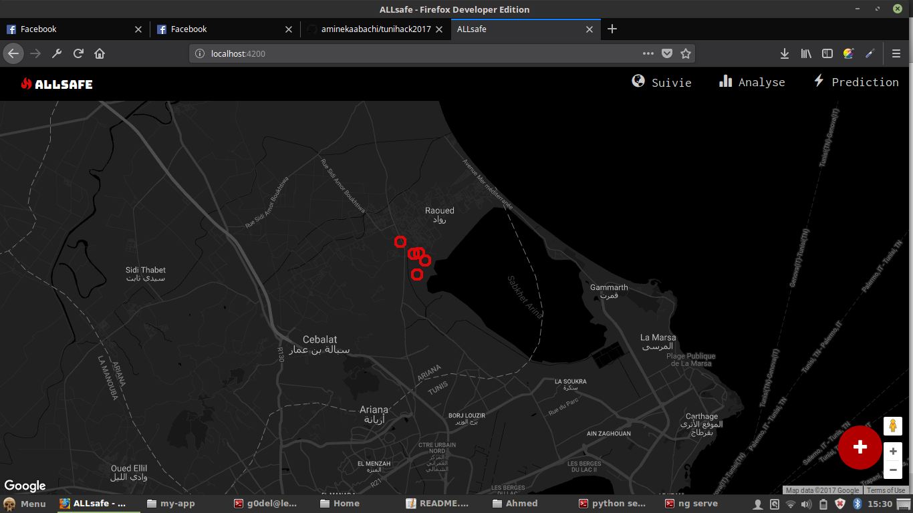
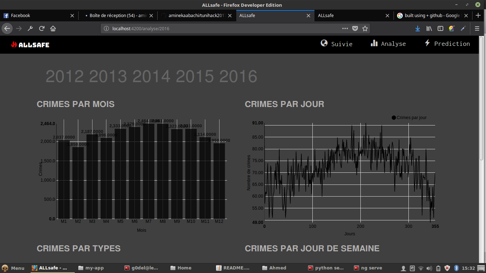
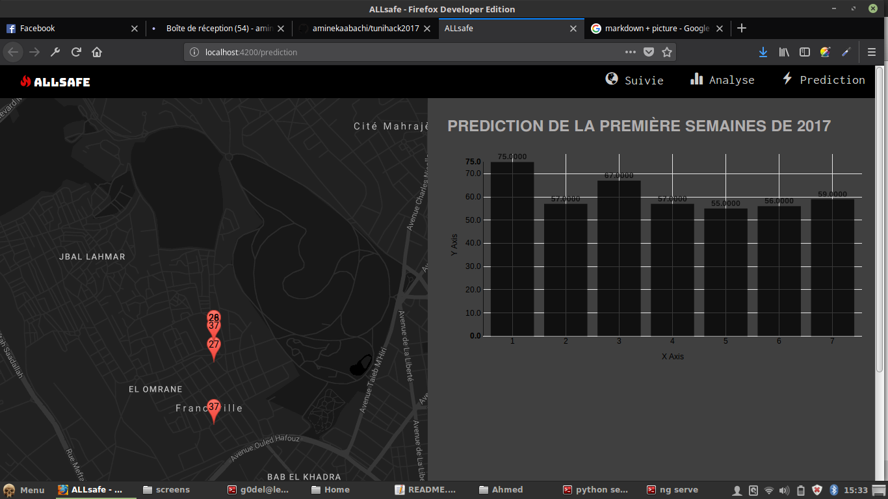
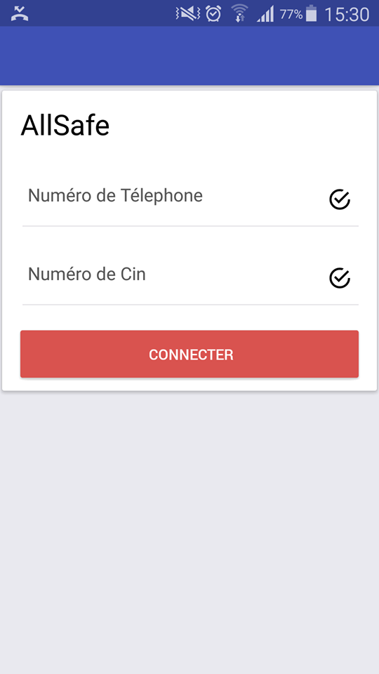
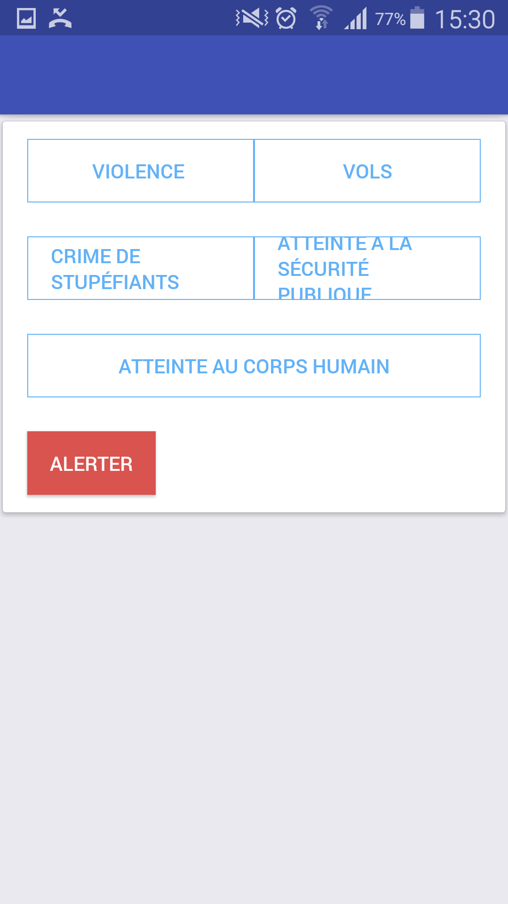

Crime Fighter 
============

Crime Prediction system that helps police mans to predict crimes location , date , types .. . developed during Tunihack hackathon with my Team "Pow 270"

# Problem 

"I believe that whatever doesn't kill you, simply makes you... stranger." 

Decrese the number of crimes in our city 

# Solution 

# Applications Developped 

* Web app was built using Flask for Rest API  and Angular 4 for the UI 

* Mobile App using React Native

* Data Analysis & Prediction using Python Tools & Spark / Scala

# Technlogies used 
- 
- 
- 
- 
- 

## Web App Screenshots

## Mobile App Screenshots

## My Team (Winner First Place ) 

- 

## Contributors 

- RebaiAhmed
- aminekaabach

## Dataset 
[link of chicago crimes dataset in kaggle ](https://www.kaggle.com/currie32/crimes-in-chicago/data)

## Feautures 
- improve System Prediction with ML algortihms 
- adding real-time notifications to mobile application to alert citizens about danger crimes or something that can be happened 

